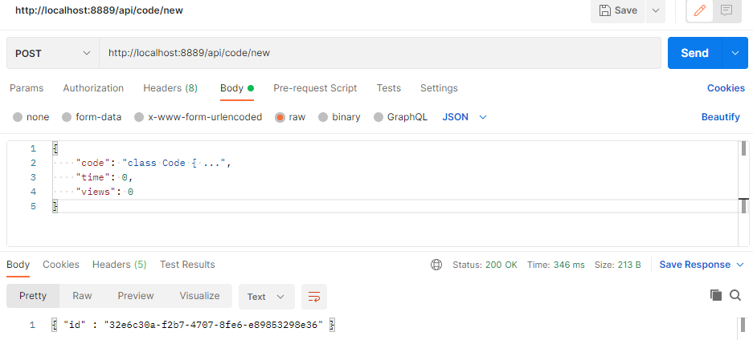
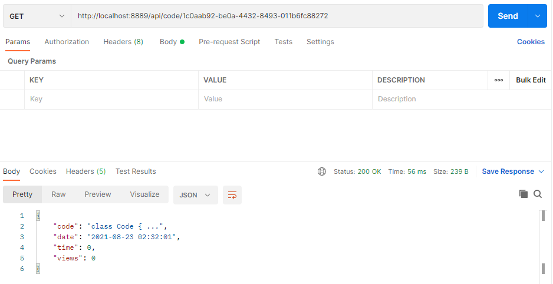
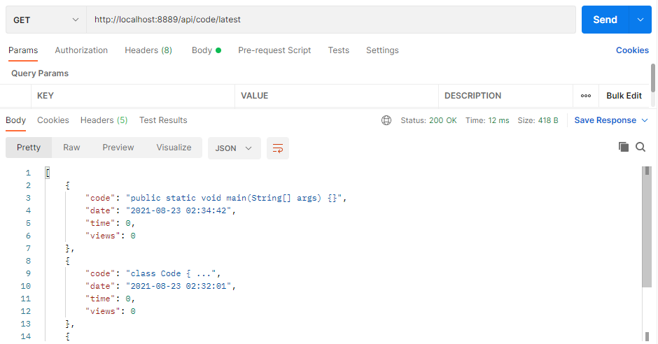
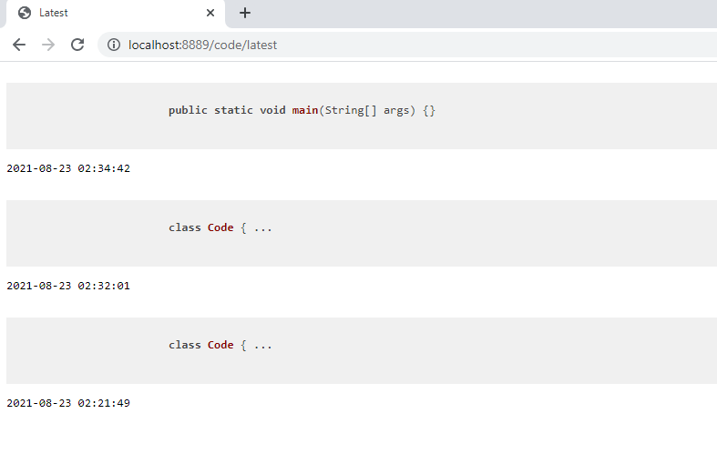
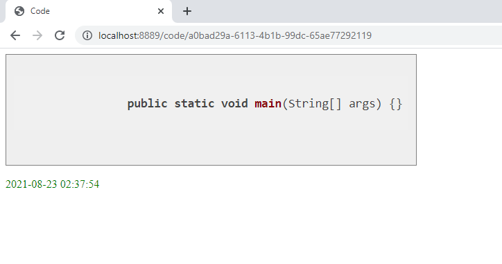
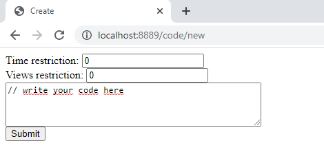

# code-sharing-platform
> Application for sharing code snippets with other people.
> 
## Table of Contents
* [General Info](#general-information)
* [Technologies Used](#technologies-used)
* [Features](#features)
* [Screenshots](#screenshots)
* [Usage](#usage)
* [Project Status](#project-status)
* [Room for Improvement](#room-for-improvement)

## General Information
The subject of the task is to implement a web application for code sharing. The application allows you to create code snippets and share them.

## Technologies Used
- Java
- Spring Boot
- JPA
- H2 database
- REST API
- HTML + CSS + JS (templates)

## Features

- GET /api/code/UUID should return JSON with the uploaded code snippet (with the given UUID).
- GET /code/UUID should return HTML that contains the uploaded code snippet (with the given UUID).
- GET /code/new contains a form that allows you to add code to the database.
- GET /api/code/latest should return a JSON array with 10 most recently uploaded code snippets sorted from the newest to the oldest.
- GET /code/latest should return HTML that contains 10 most recently uploaded code snippets. Use the title Latest for this page.

- Code snippets should be accessible via UUID links. POST /api/code/new should return a UUID of the snippet.
- POST /api/code/new should take a JSON object with a field code and two other fields:
1. time field contains the time (in seconds) during which the snippet is accessible.
2. views field contains a number of views allowed for this snippet.

- A limit on the number of views will allow viewing the snippet only a certain number of times, after which the snippet is deleted from the database.
- A limit on the viewing time will allow viewing a code snippet for a certain period of time, and after its expiration, the code snippet is deleted from the database.
- Remember, that 0 and negative values should correspond to the absence of the restriction.

- Remember that POST request should contain numbers, not strings.
- GET /api/code/latest and GET /code/latest should not return any restricted snippets.
- GET /api/code/UUID should not be accessible if one of the restrictions is triggered. Return 404 Not Found in this case and all the cases when no snippet with such a UUID was found.
- GET /api/code/UUID should show what restrictions apply to the code piece. Use the keys time and views for that. A zero value (0) should correspond to the absence of the restriction.
1. time field contains the time (in seconds) during which the snippet is accessible.
2. views field shows how many additional views are allowed for this snippet (excluding the current one).

Note: if only one of the restrictions is applied, you should show only one of the above elements.

## Screenshots
> POST /api/code/new
>

> GET /api/code/UUID
>

> GET /api/code/latest
>

> GET /code/latest
>

> GET /code/UUID
>

> GET /code/new
>

## Usage
Please send an appropriate http request in accordance with the features above:

Server: localhost:8889

Endpoints:

GET /api/code/UUID\
GET /code/UUID\
GET /api/code/latest\
GET /code/latest\
POST /api/code/new\
GET /code/new

## Project Status
Project is: _complete_

## Room for Improvement

Room for improvement:
- improve css of templates
